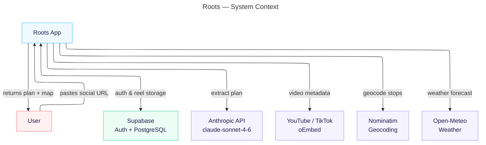
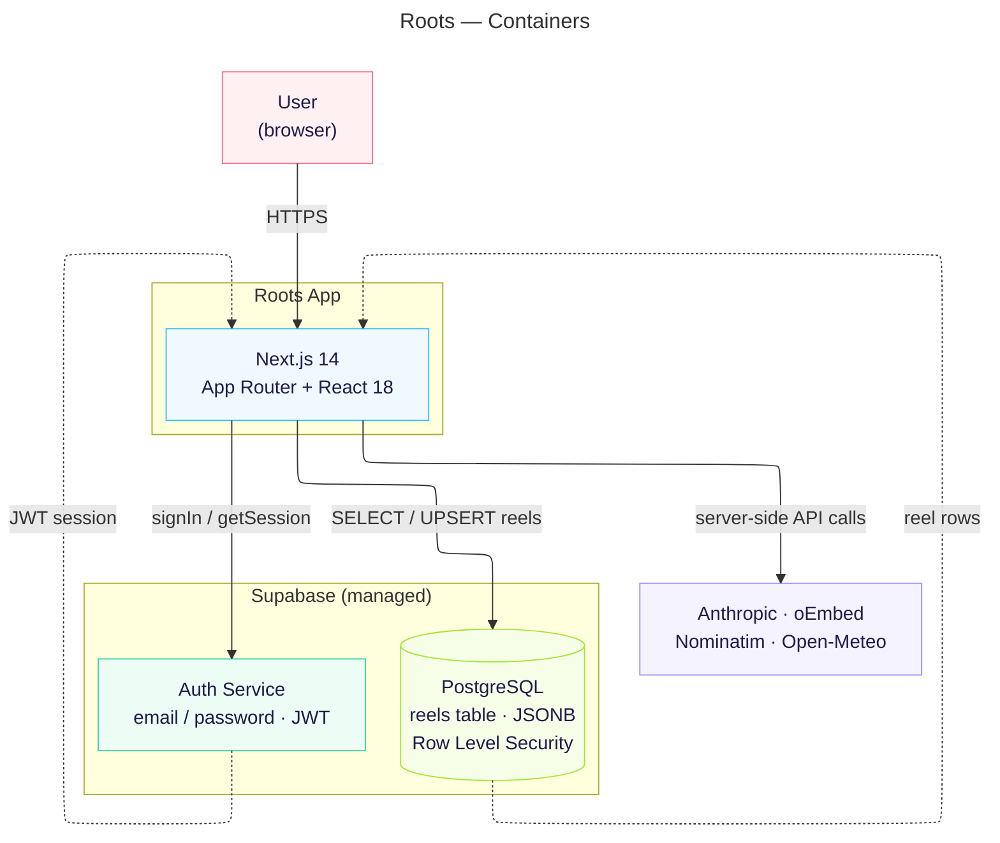
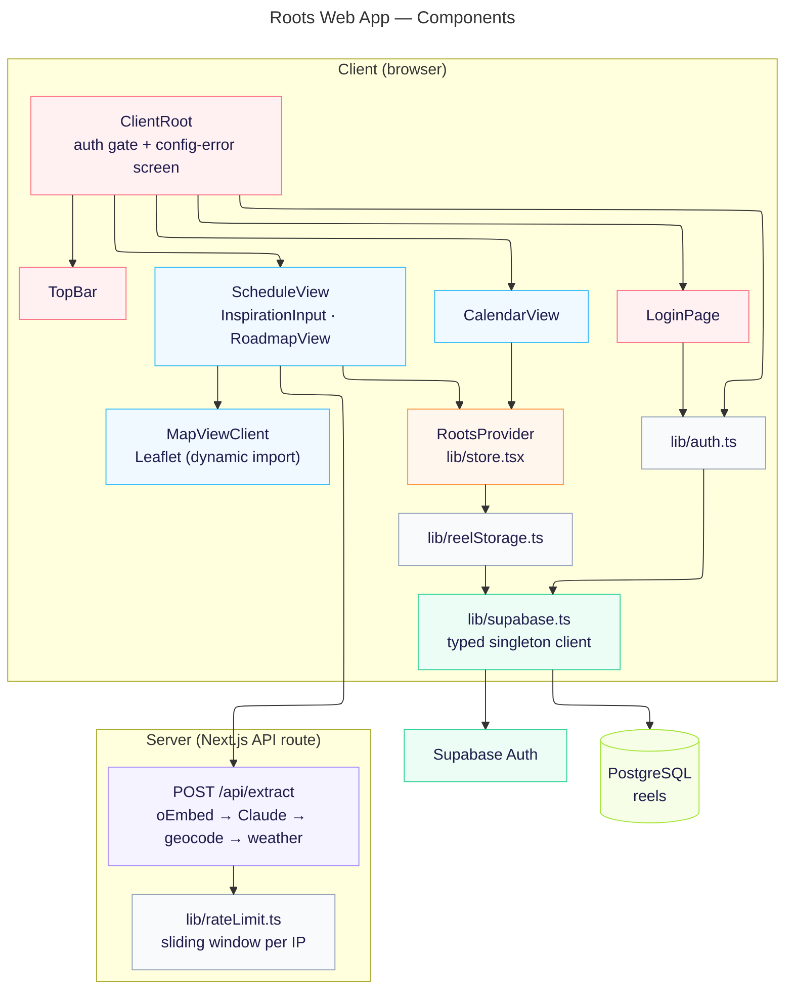
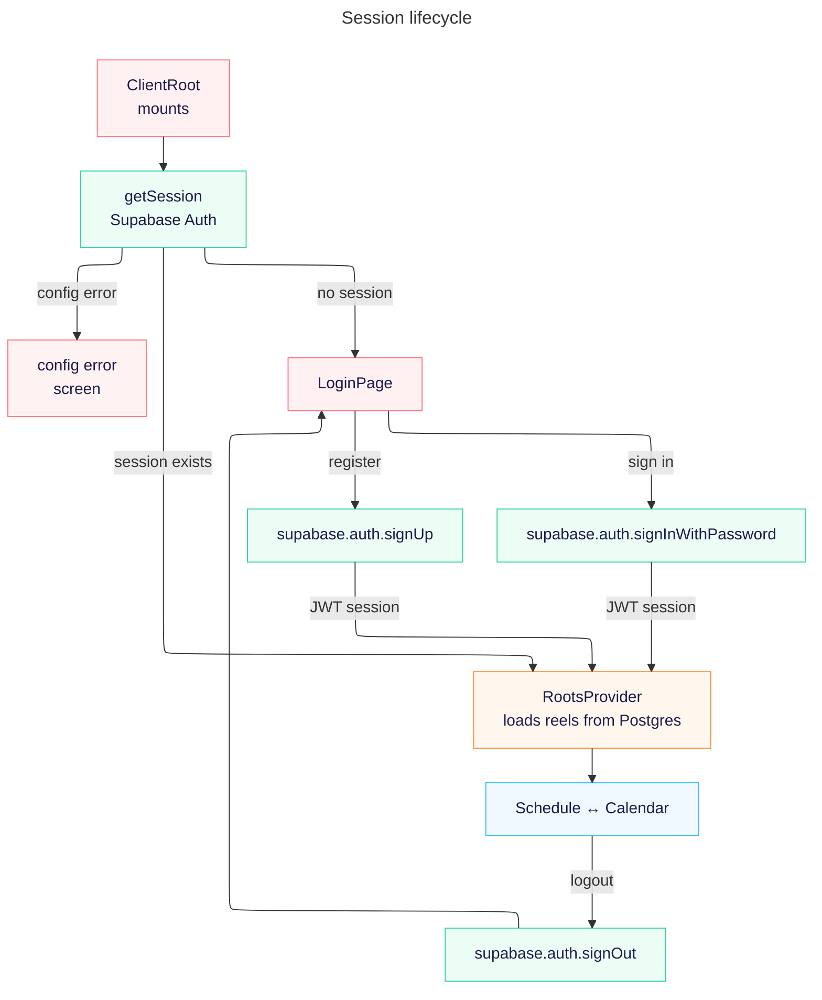
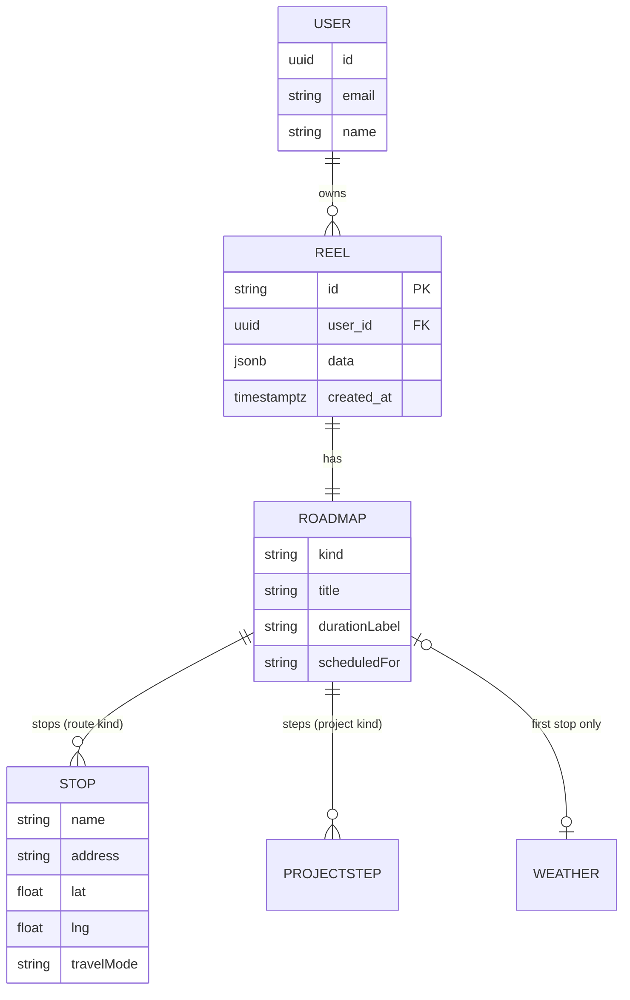

# Roots — Architecture (C4)

> Reflects `main` after the Supabase migration: Supabase Auth replaces the old localStorage auth, and extracted reels are persisted in a Postgres `reels` table so accounts and data are accessible from any device.

---

## Level 1 — System Context

---

## Level 2 — Containers

---

## Level 3 — Components

---

## Extraction flow

```mermaid
---
config:
  layout: elk
title: POST /api/extract — end to end
---
flowchart LR
    User["User\npastes URL"] --> Input["InspirationInput"]
    Input -- POST url --> API["extract/route.ts"]
    API --> RL{"rate limit\ncheck"}
    RL -- over limit --> E429["429 Too Many\nRequests"]
    RL -- ok --> Platform["detect platform\nIG · TT · YT · upload"]
    Platform --> OEmbed["oEmbed\ntitle + creator"]
    OEmbed --> Claude["Anthropic\nClaude sonnet-4-6"]
    Claude -- JSON plan --> Parse["parse +\nvalidate"]
    Parse --> Geo["Nominatim\nsequential geocode\n1 req/s"]
    Geo --> Weather["Open-Meteo\nweather for stop 1"]
    Weather --> Store["RootsProvider\naddReel"]
    Store --> SbDB[("PostgreSQL\nupsertReel")]

    User:::userNode
    Input:::uiNode
    API:::apiNode
    RL:::libNode
    Platform:::apiNode
    OEmbed:::apiNode
    Claude:::apiNode
    Parse:::apiNode
    Geo:::apiNode
    Weather:::apiNode
    Store:::stateNode
    SbDB:::dbNode
    E429:::errorNode

    classDef userNode  stroke:#fb7185,fill:#fff1f2,color:#1e1b4b
    classDef uiNode    stroke:#38bdf8,fill:#f0f9ff,color:#1e1b4b
    classDef apiNode   stroke:#a78bfa,fill:#f5f3ff,color:#1e1b4b
    classDef libNode   stroke:#94a3b8,fill:#f8fafc,color:#1e1b4b
    classDef stateNode stroke:#fb923c,fill:#fff7ed,color:#1e1b4b
    classDef dbNode    stroke:#a3e635,fill:#f7fee7,color:#1e1b4b
    classDef errorNode stroke:#f87171,fill:#fef2f2,color:#1e1b4b
```

---

## Auth flow

---

## Data model

