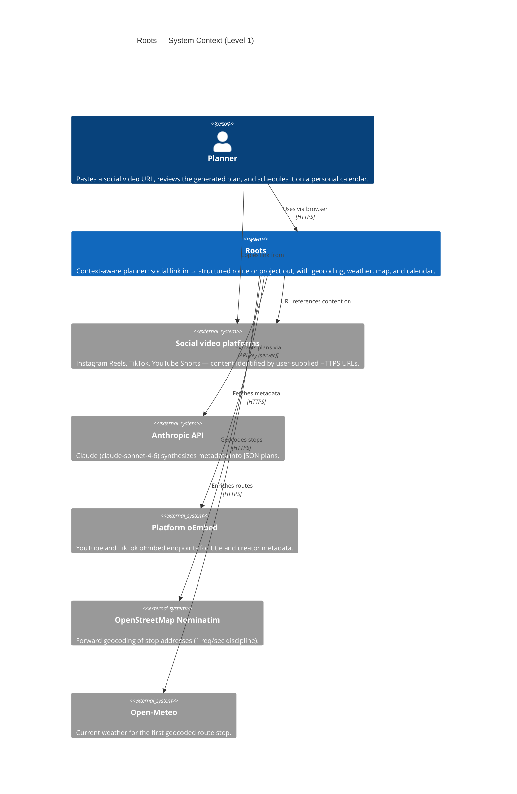
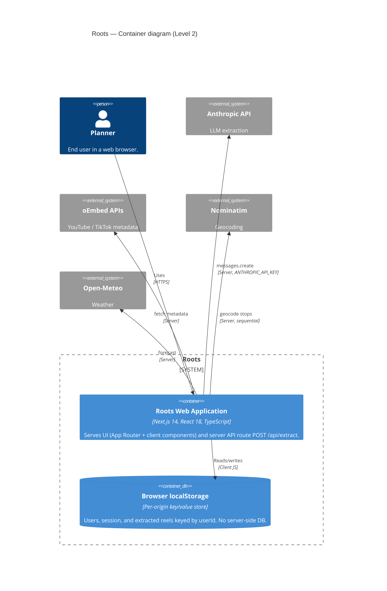
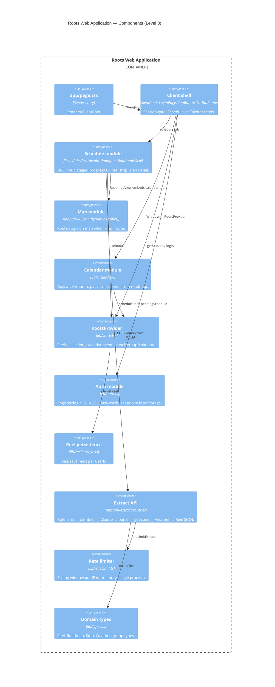
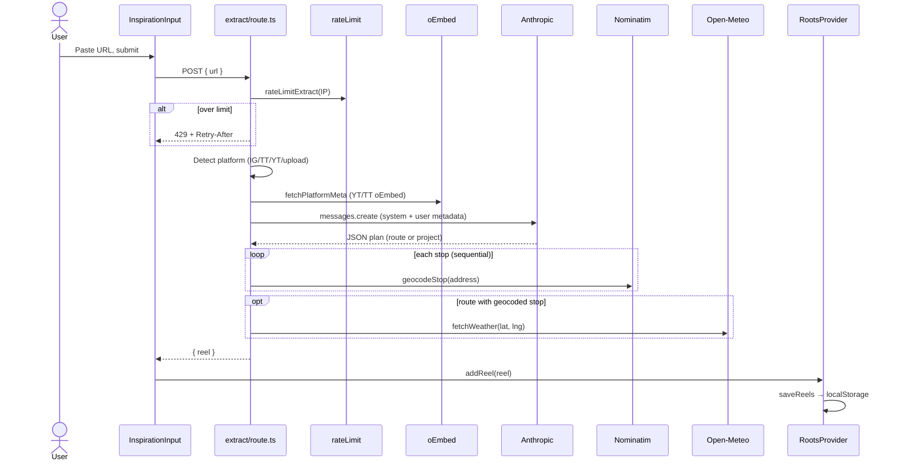
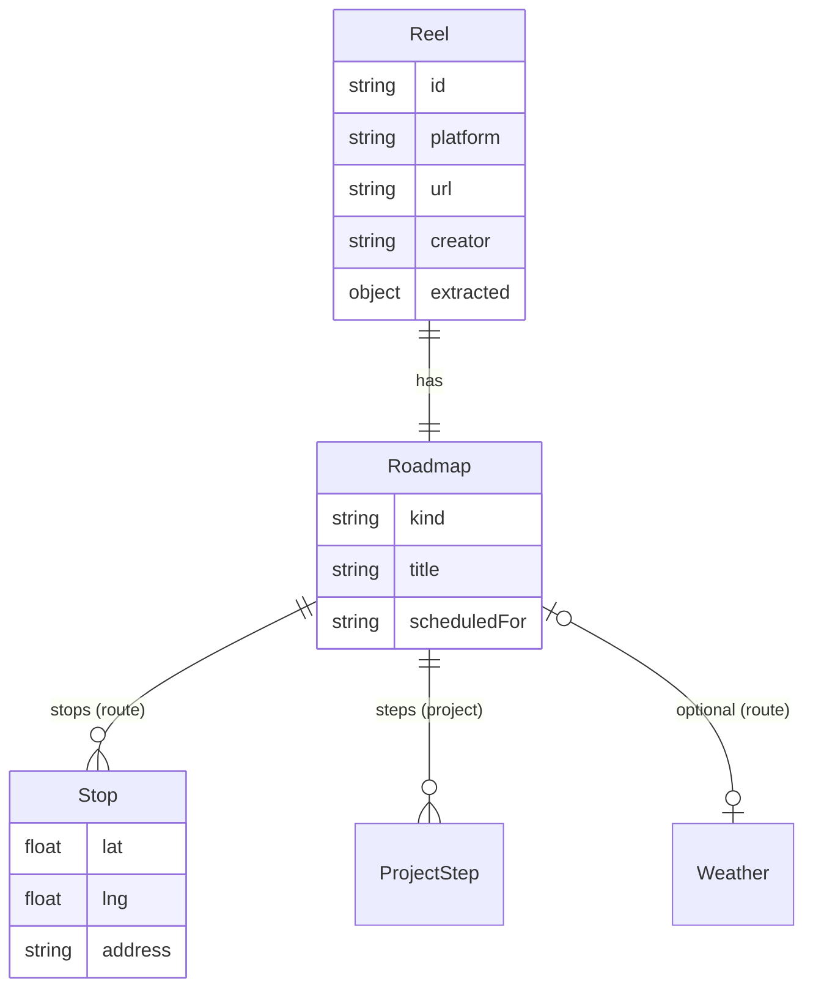
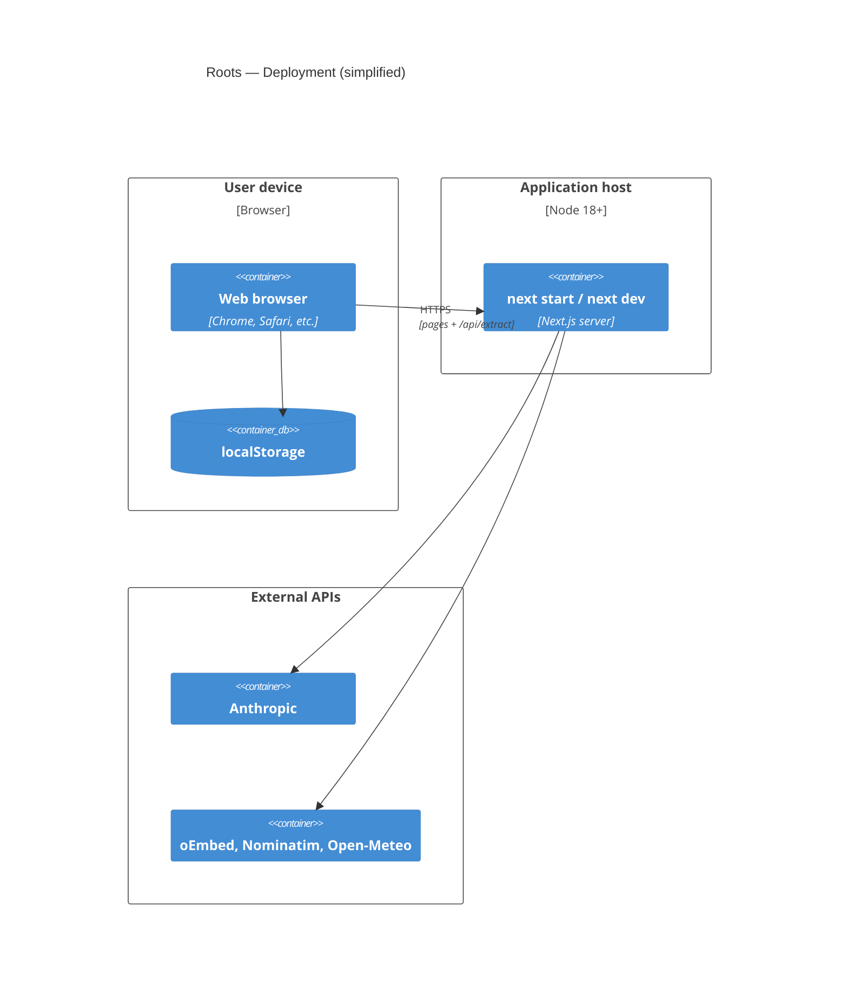

# Roots Application Architecture (C4)

Architecture of the **Roots** Next.js app as implemented in [`Roots/`](../Roots/). Reflects the codebase after the latest `main` sync (live extraction, client auth, `localStorage` persistence, Schedule + Calendar as the default shell).

> The sibling file [`architecture.md`](./architecture.md) holds earlier high-level data-flow sketches. This document is the C4 view of the **current** Roots implementation.

---

## Summary

| Aspect | Current implementation |
|--------|-------------------------|
| **Purpose** | Turn Instagram / TikTok / YouTube URLs into actionable **routes** or **projects**, with map, weather, and calendar scheduling |
| **Deployable unit** | Single Next.js 14 application (App Router) |
| **Server persistence** | None — no database |
| **Client persistence** | `localStorage` (users, session, reels per user) |
| **AI & enrichment** | `POST /api/extract` orchestrates oEmbed, Claude, Nominatim, Open-Meteo |
| **Default UI** | Login → Schedule (extract + roadmap + map) ↔ Calendar |
| **In repo, not default home** | Group / Gerardbot views (`GroupView`, `GerardbotChat`, etc.) backed by mock data in context |

---

## Level 1 — System Context

Who uses Roots, what Roots does, and which external systems it talks to.



---

## Level 2 — Containers

Major runnable / deployable parts inside and around Roots.



### Container notes

| Container | Technology | Responsibilities |
|-----------|------------|------------------|
| **Roots Web Application** | Next.js App Router, Tailwind, Leaflet (client-only) | Auth gate, Schedule/Calendar UI, extraction API, in-memory rate limit |
| **Browser localStorage** | Web Storage API | `roots_users`, `roots_session`, `roots_reels_{userId}` |

Environment variables (see [`Roots/.env.example`](../Roots/.env.example)):

- `ANTHROPIC_API_KEY` — required for extraction
- `RATE_LIMIT_EXTRACT` — optional, default `5 per hour` per client IP

---

## Level 3 — Components (Web Application)

Internal structure of the Next.js app: UI modules, shared client state, and the extract pipeline.



### Component inventory (by folder)

| Area | Key files | Role |
|------|-----------|------|
| **App** | `app/layout.tsx`, `app/page.tsx`, `app/api/extract/route.ts` | Layout, home, extraction orchestration |
| **Shell** | `components/ClientRoot.tsx`, `LoginPage.tsx`, `TopBar.tsx`, `ActiveTabRouter.tsx` | Auth + tab routing |
| **Schedule** | `ScheduleView.tsx`, `InspirationInput.tsx`, `RoadmapView.tsx`, `MapViewClient.tsx` | Primary user journey |
| **Calendar** | `CalendarView.tsx` | Timeline placement |
| **Lib** | `store.tsx`, `auth.ts`, `reelStorage.ts`, `rateLimit.ts`, `types.ts`, `mockData.ts` | State, auth, persistence, limits, seeds |
| **Latent UI** | `GroupView.tsx`, `GerardbotChat.tsx`, `TodayView.tsx`, `RoadmapsView.tsx` | Not mounted on default `page.tsx`; store still holds mock proposals/chat |

---

## Key flows

### Extraction (`POST /api/extract`)



### Authenticated session and navigation

```mermaid
flowchart LR
    A[ClientRoot] --> B{Session in localStorage?}
    B -->|no| C[LoginPage]
    C --> D[register / login → auth.ts]
    D --> E[RootsProvider]
    B -->|yes| E
    E --> F[TopBar: Schedule | Calendar]
    F --> G[ActiveTabRouter]
    G --> H[ScheduleView]
    G --> I[CalendarView]
```

---

## Data model (client)

Core types live in [`Roots/lib/types.ts`](../Roots/lib/types.ts).



**Server** does not persist reels; each extraction returns a `Reel` JSON payload consumed by the client.

---

## Deployment view (Level 4 — simplified)

Typical local or hosted deployment: one Node process running Next.js.



**Operational constraints**

- Rate limiting is **in-process memory** — not shared across multiple server instances.
- Nominatim usage is **sequential** per request to respect ~1 req/sec policy.
- Auth is a **prototype** (local passwords in `localStorage`) — not suitable for production without a real IdP.

---

## Testing boundary

| Layer | Location | Covers |
|-------|----------|--------|
| Unit / API | `Roots/__tests__/roots.test.ts`, `rateLimit.test.ts` | Extract route behavior, URL validation, rate limit parsing |
| Manual | `npm run dev` | End-to-end with `ANTHROPIC_API_KEY` |

---

## Related documentation

- [`Roots/README.md`](../Roots/README.md) — setup, scripts, feature overview
- [`Roots/PROTOTYPE.md`](../Roots/PROTOTYPE.md) — UX notes (partially superseded by live extraction)
- [`architecture/architecture.md`](./architecture.md) — earlier conceptual diagrams
