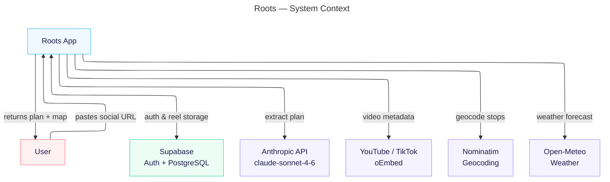
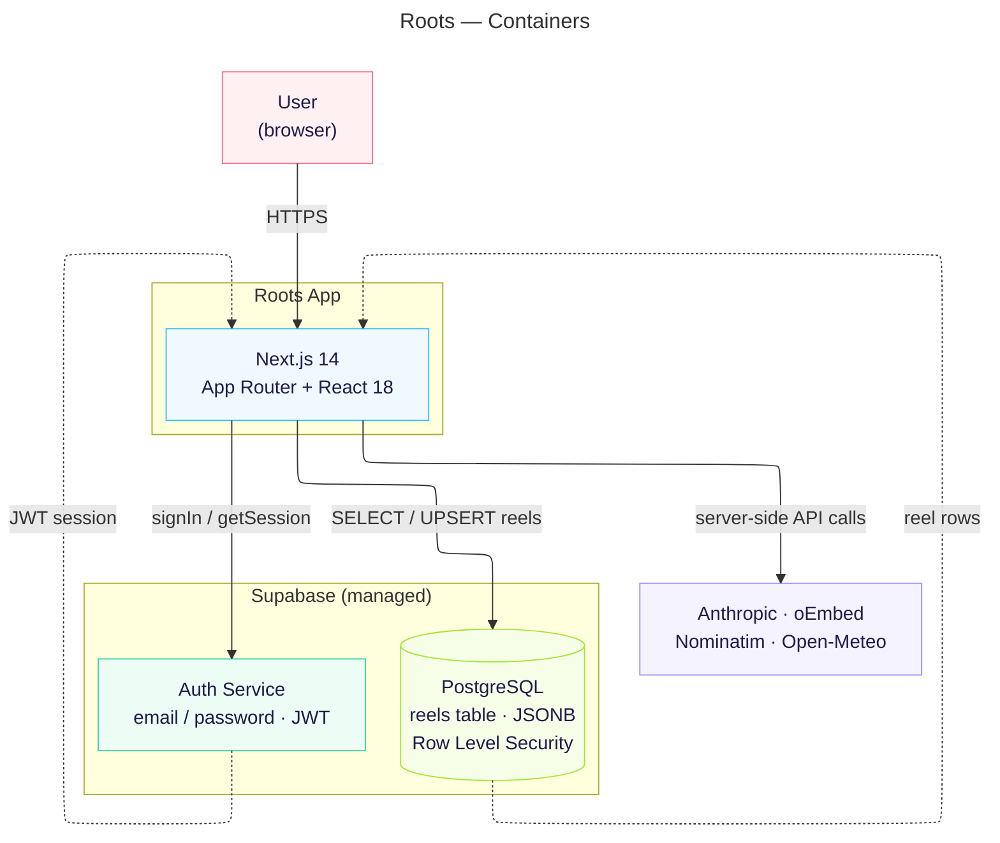

# Architecture retrospective

Reverse-engineered ADR-style note: what we sketched in W4 (`architecture/W4-Architecture.md`), what actually shipped on `main` in [`Roots/`](../Roots/), and what we are carrying into code freeze. Diagrams match [`architecture/updated-architecture.md`](../architecture/updated-architecture.md).

---

## Current-state architecture

On `main` today, Roots is one Next.js app. The browser talks to Supabase for login and reel storage, and to our server only for `POST /api/extract`. Extraction chains oEmbed (YouTube/TikTok), Claude, Nominatim, and Open-Meteo. There is no separate Meta API container and no custom database we operate ourselves.

### C4 — System context (Level 1)

### C4 — Containers (Level 2)

**W4 vs today in one glance:** W4 drew a generic `Database` plus `YOUTUBE_API` and `META_API` feeding Claude. We never stood up Meta’s API. Instagram URLs go straight to Claude with whatever oEmbed does not provide (which, for IG, is basically nothing). Persistence is Supabase, not an unnamed box.

---

## Decisions that shifted

### 1. Platform APIs → oEmbed + inference

**Context:** W4 assumed YouTube and Meta would supply metadata upstream of Claude. Once we tried to build it, Instagram had no oEmbed path in our stack, TikTok/YouTube oEmbed was enough to get a title and handle, and sprint pressure meant we were not getting Graph API keys sorted before demo.

**Decision:** Keep Claude as the single “brain.” Call oEmbed only for YouTube and TikTok. Let Claude infer captions and locations from the URL and platform when metadata is thin.

**Consequences:** Fewer moving parts and no Meta app review, but Instagram-heavy demos depend on model guesswork. Extraction quality varies by platform in ways our W4 diagram hid.

**Classification:** **Deliberate and prudent** — we traded API breadth for something shippable; the gap is documented in code (`fetchPlatformMeta` fallbacks), not in a forgotten ADR.

---

### 2. `localStorage` auth → Supabase Auth + Postgres reels

**Context:** First working login was a Friday-night-style prototype: users and reels in `localStorage`, SHA-256 in the browser. That got demos unblocked locally, but data did not follow the user across devices, red-team style feedback in sprint 2 called out uncredited extract abuse, and we needed “real” accounts without running our own auth service before code freeze.

**Decision:** Migrate to Supabase Auth and a `reels` JSONB table with RLS, client SDK in `lib/supabase.ts`, server extract unchanged.

**Consequences:** Supabase project setup, env vars, and RLS policies are now part of every onboarding path. We accept vendor coupling and a manual SQL migration step. We gained persisted reels per user and a path to per-user limits later.

**Classification:** **Deliberate and prudent** — we knew localStorage was throwaway; the migration commits (`c77afd5`, `93004a7`) were intentional paydown, not surprise debt.

---

### 3. Full product surface → Schedule + Calendar on the default route

**Context:** W4’s container diagram reads like one cohesive app: user, web app, database, APIs. The repo still has `GroupView`, `GerardbotChat`, and mock proposals in `store.tsx`, but the home page in `Roots` only mounts Schedule and Calendar. Roland’s prototype branch still carries the wider tab shell.

**Decision:** Ship the solo path—paste URL, see roadmap/map, place on calendar—for code freeze. Leave group coordination as mock state and dead UI entry points.

**Consequences:** Demo story is coherent; product vision language about “friends” and voting is not backed by live architecture. Merging prototype tabs back in is a integration task, not a flip of a feature flag.

**Classification:** **Deliberate and reckless** — we knowingly narrowed scope under deadline; the unused components are reckless only if we pretend group mode exists for graders.

---

## Tech debt heading into code freeze

| Item | Fowler quadrant | Plan |
|------|-----------------|------|
| Calendar events live only in React state (`store.tsx`), lost on refresh | Inadvertent and prudent | **Live with it** through demo night; reels persist, calendar does not. |
| In-memory IP rate limit on `/api/extract` (not per Supabase user) | Deliberate and prudent | **Live with it**; good enough for single-instance Vercel; sprint-2 wanted credited users partially satisfied by login existing. |
| Group / Gerardbot UI and mock votes in store, not on default route | Deliberate and reckless | **Live with it**; do not demo as shipped group features. |

---

## With another sprint

We would write the ADR when we make the call—not after—and wire calendar persistence and per-user extract quotas in the same PR as Supabase auth so “logged in” actually gates cost, not just stores reels.
