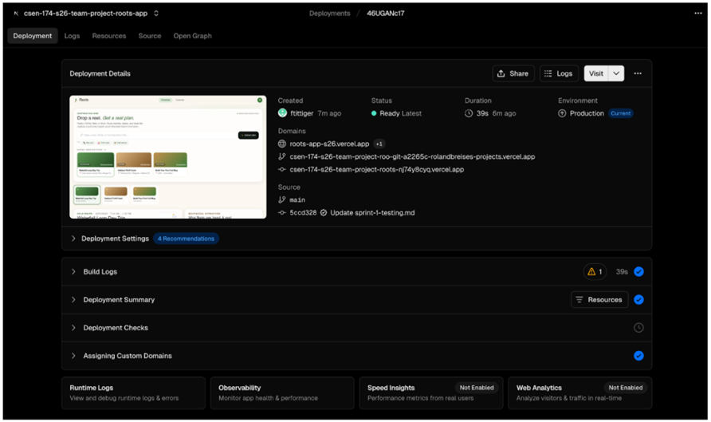

# Week 6
**Team:** Roland, Cole, Frank

## Part 1: Working CI workflow (4 pts)

**In the write-up, include:**
* A link to one merged PR showing the passing CI check.
  * [https://github.com/CSEN-SCU/csen-174-s26-team-project-roots-app/pull/19](https://github.com/CSEN-SCU/csen-174-s26-team-project-roots-app/pull/19)
* A short paragraph (3 to 5 sentences) on how the team handled secrets: which secrets exist, which environment surface (CI, deployment, or both) needs each one, and how the workflow reads them at runtime.

**Team Response:**
To handle secrets, we use GitHub's secrets and variables. Currently, the only secret we have is our Anthropic API key. Currently, we can technically do our integration tests and deployments without the API key, but these tests only pass vacuously, and actual tests for functionality need the API key. From what we understand about GitHub Secrets, when the workflow is run on a new PR, the actual API key value is injected by GitHub into the designated placeholders in the file.

---

## Part 2: Live deployment (4 pts)

Deploy the application to a public URL.

**Required:**
* A reachable URL, accessible from off-campus, that returns a working landing page.
* The deployment is stable for the 24 hours leading into the deadline. "Working" means the landing page loads without server errors and the core entry point of your product is visible (a homepage, a sign-in screen, the main UI). It does not need every feature wired up.
* Secrets used in deployment (API keys, database credentials, etc.) live in the deployment platform's environment settings, not in code.

**In the write-up, include:**
* **Deployment URL:** [https://roots-app-s26.vercel.app](https://roots-app-s26.vercel.app)
* A screenshot of the deployment platform's dashboard showing successful deploys (Vercel, Netlify, Render, Fly.io, Railway, AWS Amplify, and similar all expose a "Deployments" view).

  

**Team Response:**
We decided to deploy our website via Vercel because of its compatibility with GitHub and its optimization for our web stack. That allowed for easy automation of the entire building process. Moreover, it perfectly fitted our requirements because right after signing up, we were provided with an automatically generated URL without having to configure a separate server ourselves. What got us at first was our negligence to configure our environment variables within the Vercel settings before the build took place. Since we made sure not to commit any `.env` files containing our API keys into the source code, everything went well initially, but our landing page gave us an error when trying to fetch our data.