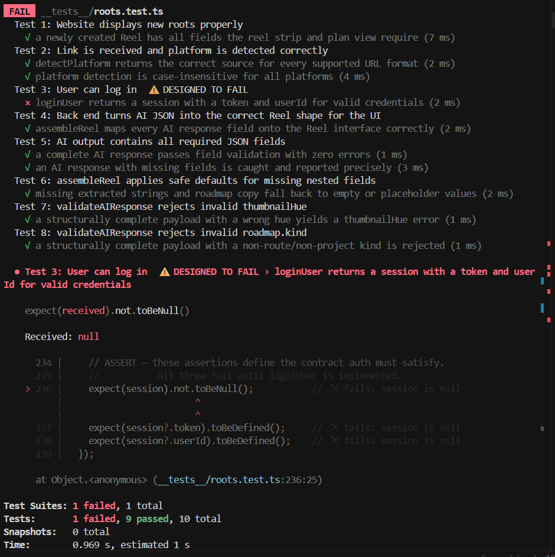
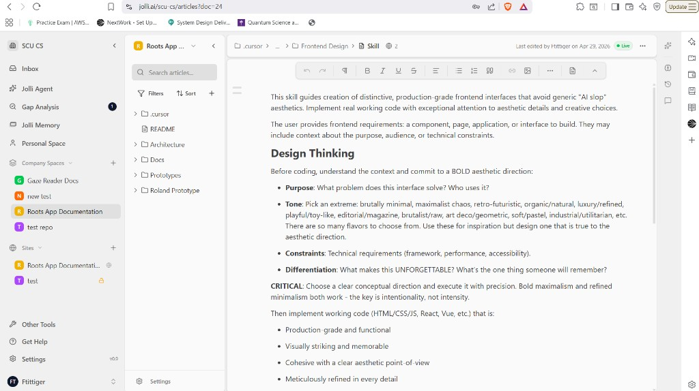

# Sprint 1 Testing

## Part 1 & 2
test directory:
csen-174-s26-team-project-roots-app\Roots\__tests__\roots.test.ts


## Part 3
To write remaining AI tests, we used the test driven development skill (https://github.com/obra/superpowers/tree/main/skills/test-driven-development). This skill fits our team’s repo as a large part of our project relies on extracting specific json fields from AI responses, and this skill ensures that the tests we develop for testing this functionality catches if the LLM response JSON does not contain the fields we desire. With this skill introduced, our workflow changes as we now if we want certain functionality from our AI responses, we implement failing tests for that functionality first before generating the actual code.

## Part 4
Test 5: Tests express user needs by testing for existence of specifc fields that need to be displayed. Refactoring shouldn't break the tests or change observable behavior, as long as refactored code still provides required fields. We cannot identify any domain specific cases that AI may not have tested, most tests are already domain specific.

Test 6: Test is centered more around code functionality, specifically ensuring that safe defaults are applied to missing fields in JSON payloads. Refactoring would change observable behavior, if different defaults are applied, the test needs to be rewritten to check for that specific default. There are some metadata fields that reels contain that are not specifically checked here, however this test is meant to be used after that metadata from reels has been processed by AI into new JSON payload.

### Diff

```diff
-describe("Test 5: AI output contains all required JSON fields", () => {
-  test("a complete AI response passes field validation with zero errors", () => {
-    // ARRANGE — raw JSON string as the AI returns it (before we parse it in route.ts)
+describe("Test 5: Model JSON is fit to turn into a user-visible day plan", () => {
+  test("when the model returns a valid route payload, validation passes and the app can assemble a planner-ready reel", () => {
     const rawAIOutput = `{
       "platform": "instagram",
       "creator": "@bayareatrails",
       "thumbnailHue": "moss-400",
       "caption": "Chasing five waterfalls on one loop — $6 entry, bring layers.",
       "extracted": {
         "transcript": "We pulled into Uvas Canyon County Park around eight and hit the Waterfall Loop, a 4-mile trail passing five distinct waterfalls.",
         "visualTags": ["waterfall", "redwood canopy", "trail markers", "kiosk fee box"],
         "locationGuess": "Uvas Canyon County Park, Morgan Hill, CA",
         "detectedHours": "Open daily 8 AM – sunset",
         "instructions": ["Arrive early for parking", "Bring $6 cash or card for day-use fee"]
       },
       "roadmap": {
         "kind": "route",
         "title": "Uvas Canyon Waterfall Loop",
         "summary": "A 4-mile loop passing five waterfalls through old-growth redwoods.",
         "durationLabel": "Saturday · 8:00 AM – 1:30 PM",
         "scheduledFor": "2026-04-25T08:00:00",
         "stops": [
           {
             "id": "s1",
             "name": "Uvas Canyon County Park",
             "category": "Trailhead",
             "address": "8515 Croy Rd, Morgan Hill, CA 95037",
             "lat": 0,
             "lng": 0,
             "hours": "Open daily 8 AM – sunset",
             "travelMinutesFromPrev": null,
             "travelMode": null,
             "note": "Pay $6 day-use fee at the entrance kiosk"
           }
         ]
       }
     }`;


-    // ACT — parse the raw string and run the same validation the app uses
     const parsed = JSON.parse(rawAIOutput) as Record<string, unknown>;
-    const errors = validateAIResponse(parsed);
-
-
-    // ASSERT — no missing or invalid fields
-    expect(errors).toHaveLength(0);
-    expect(parsed.platform).toBe("instagram");
-    expect(VALID_THUMBNAIL_HUES).toContain(parsed.thumbnailHue);
-    expect(VALID_ROADMAP_KINDS).toContain((parsed.roadmap as Record<string, unknown>).kind);
-    expect((parsed.extracted as Record<string, unknown[]>).visualTags).toHaveLength(4);
-    expect((parsed.roadmap as Record<string, unknown[]>).stops).toHaveLength(1);
+    const sourceUrl = "https://www.instagram.com/reel/uvas-demo";
+
+    assertValidatedModelPlanWorksEndToEndInTheUi(parsed, sourceUrl);
+    expect((parsed.roadmap as Record<string, unknown>).kind).toBe("route");
   });


-  test("an AI response with missing fields is caught and reported precisely", () => {
-    // ARRANGE — intentionally incomplete response: missing thumbnailHue,
-    //           roadmap.durationLabel, and extracted.locationGuess
+  test("when the model omits logistics users need, we refuse the payload (stable field paths, not exact error copy)", () => {
+    // Domain: card theming, map context, and schedule copy are required for a credible plan.
+    // Include a step so failures are only about the intentional gaps (not project-without-steps).
     const incompleteResponse: Record<string, unknown> = {
       platform: "youtube",
       creator: "@someCreator",
-      // thumbnailHue intentionally omitted
       caption: "A test plan",
       extracted: {
         transcript: "Some transcript text.",
         visualTags: ["tag1", "tag2"],
-        // locationGuess intentionally omitted
       },
       roadmap: {
         kind: "project",
         title: "Test Project Plan",
         summary: "A project plan summary.",
-        // durationLabel intentionally omitted
         scheduledFor: "2026-04-25T10:00:00",
+        steps: [
+          {
+            id: "p1",
+            title: "Do the thing",
+            detail: "One step so the plan is not empty.",
+            durationMin: 15,
+          },
+        ],
       },
     };


-    // ACT
     const errors = validateAIResponse(incompleteResponse);
+    const joined = errors.join("\n");


-    // ASSERT — each omitted field is reported
     expect(errors.length).toBeGreaterThan(0);
-    expect(errors.some((e) => e.includes("thumbnailHue"))).toBe(true);
-    expect(errors.some((e) => e.includes("extracted.locationGuess"))).toBe(true);
-    expect(errors.some((e) => e.includes("roadmap.durationLabel"))).toBe(true);
+    expect(joined).toContain("thumbnailHue");
+    expect(joined).toContain("locationGuess");
+    expect(joined).toContain("durationLabel");
   });
+
+
+  test("when the model declares a route but sends no stops, we block it (empty itinerary)", () => {
+    const routeWithNoStops: Record<string, unknown> = {
+      platform: "youtube",
+      creator: "@creator",
+      thumbnailHue: "moss-300",
+      caption: "A day out",
+      extracted: {
+        transcript: "We visit several spots downtown.",
+        visualTags: ["street", "café", "signage", "transit"],
+        locationGuess: "Downtown, Example City, CA",
+      },
+      roadmap: {
+        kind: "route",
+        title: "Downtown crawl",
+        summary: "Walkable stops.",
+        durationLabel: "Saturday · 10 AM – 2 PM",
+        scheduledFor: "2026-05-10T10:00:00",
+        stops: [],
+      },
+    };
+
+
+    const errors = validateAIResponse(routeWithNoStops);
+    expect(
+      errors.some(
+        (e) =>
+          e.includes("stop") &&
+          (e.includes("route") || e.includes("travelers") || e.includes("place"))
+      )
+    ).toBe(true);
+  });
+
+
+  test("when the model sends visualTags as one string (common LLM slip), we reject it", () => {
+    const stringTags: Record<string, unknown> = {
+      platform: "tiktok",
+      creator: "@creator",
+      thumbnailHue: "clay-400",
+      caption: "Tags wrong shape",
+      extracted: {
+        transcript: "Narration.",
+        visualTags: "waterfall, trail, parking lot",
+        locationGuess: "Somewhere, CA",
+      },
+      roadmap: {
+        kind: "project",
+        title: "Fix tags",
+        summary: "Should be an array.",
+        durationLabel: "1 hour",
+        scheduledFor: "2026-05-01T12:00:00",
+        steps: [
+          { id: "p1", title: "Step", detail: "Detail", durationMin: 10 },
+        ],
+      },
+    };
+
+
+    const errors = validateAIResponse(stringTags);
+    expect(errors.some((e) => e.toLowerCase().includes("visualtags"))).toBe(true);
+  });
 });
```

## Part 5
## Image
[Roots App Documentation](https://roots-app-docs-scu-cs.jolli.site/)


